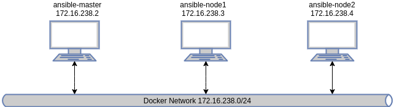

# Ansible Playground
This project spins up a docker-compose environments which allows you to run Ansible playbooks without worring about setting up any VM. 
SSH is also setup between Ansible control node and managed nodes. 

**NOTE: The examples are tested on Ansible 2.9.**

## Prerequesite
Install the following tools before running the examples in this repository. You may also need to install some dependecies before installing these tools. 
* [Docker CE](https://docs.docker.com/engine/install/)
* [Docker Compose](https://docs.docker.com/compose/install/)

## Environment Overview
The environment comprises of three docker containers running on a docker network 172.16.238.0/24. 
* docker container "ansible-master" is the Ansible control node which runs Ubuntu with Ansible already installed.
* docker containers "ansible-node1" and "ansible-node2" are the Ubuntu systems to be configured.



## Create Environment
* To start up a new environment:
```bash
docker-compose build
docker-compose up
```

* To tear down an environment
```bash
docker-compose down
```

## Verify SSH connections
Log into ansible-master and SSH onto the other two managed nodes.
```bash
# Log into ansible-master docker image
docker exec -it ansible-master bash

# SSH to ansible-node1, you'll be asked to confirm that you want to continue if you do this the first time.
ssh ansible-node1

# quit SSH connection to ansible-node1
exit

# SSH to ansible-node2. Again, you'll be asked to confirm that you want to continue if you do this the first time.
ssh ansible-node2

# quit SSH connection to ansible-node2
exit

# quit the connection to ansible-master, you'll return to your host
exit
```

## Basic Concepts
Please read [this](https://docs.ansible.com/ansible/latest/user_guide/basic_concepts.html) document before jumping onto playground. 


## Index
* [Getting Started](./playground/getting-started/README.md)
* [Inventory](./playground/inventory/README.md)
