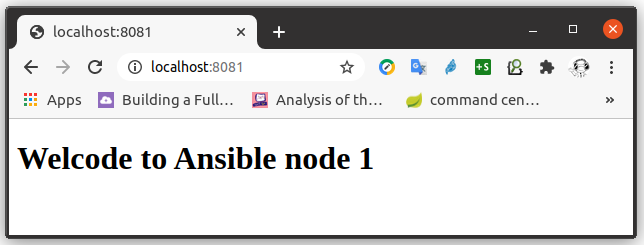
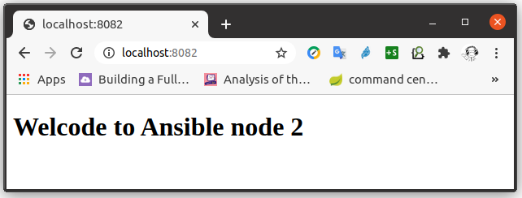

# Playbook Overview
We are going to created two instances of Apache server by Ansible playbook. The playbook will contain the basic building blocks of Ansible.

## Before you begin
The environment of running the Ansible playbook is setup by the following steps. 
```bash
# go to the project root folder if you are not here
cd ansible-learning

# destroy existing docker images which might contain results of previous running of playbooks
docker-compose down

# spinning up new docker images for this test
docker-compose up

# logging into the anisble master docker image
docker exec -it ansible-master bash

# inside ansible master docker image, go to the folder of this lab
cd /root/playground/playbook-overview

# test connections with both managed nodes
# SSH to node1
ssh ansible-node1
# exit the ssh sesseion and come back to master node
exit
# SSH to node2
ssh ansible-node2
# exit the ssh sesseion and come back to master node
exit
```

## Directory structure
The directory tree of folder /root/playground/playbook-overview looks like this:
```text
|-- README.md
|-- host_vars
|   |-- ansible-node1.yml
|   `-- ansible-node2.yml
|-- inventory
|-- templates
|   |-- 000-default.conf.j2
|   |-- index.html.j2
|   `-- ports.conf.j2
`-- website.yml
```
* The file "website.yml" is the ansible playbook used in this lab.
* The file "inventory" is the inventory of ansible playbook used in this lab.
* The folder "host_vars" contains variables for each managed node.
* The folder "templates" contains the templates used in this lab.

## Inventory
The [inventory](./inventory) file defines a single group "webservers" which contains two nodes.
```ini
[webservers]
ansible-node1
ansible-node2
```

## Host variables
The files under folder "[host_vars](./host_vars)" define variables for each host of Ansible inventory in YAML format, one file for each host. The naming of these files follows the names in inventory file, with an optional extension "yml". 

The files simply customize the webserver names by variable "ansible_node". 

### ansible-node1.yml
```yml
---
ansible_node: "Ansible node 1"
```

### ansible-node2.yml
```yml
---
ansible_node: "Ansible node 2"
```

## Templates
The files under folder "[templates](./templates)" define templates in Jinja2 format for Apache servers.

The files [ports.conf.j2](./templates/ports.conf.j2) and [000-default.conf.j2](./templates/000-default.conf.j2) configure Apache to serve its website over port 8080 other than the default port 80. 

The [index.html.j2](./templates/index.html.j2) defines the home page of Apache website. 
```html
<!DOCTYPE html>
<html>
  <body>
    <h1> Welcode to {{ansible_node}}
  </body>
</html>
```
The variable "ansible_node" will be replaced by each Apache instance with its name. 

## Playbook
The file [website.yml](./website.yml) defines the playbook to create two instances of Apache server. 
```yml
---
- hosts: webservers
  remote_user: root

  tasks:
  - name: install apache2 
    apt:
      name: apache2
      update_cache: yes
      state: latest
  - name: enabled mod_rewrite
    apache2_module: name=rewrite state=present
    notify:
      - restart apache2
  - name: apache2 listen on port 8080
    template: 
      src: ports.conf.j2 
      dest: /etc/apache2/ports.conf
    notify:
      - restart apache2
  - name: apache2 virtualhost on port 8080
    template: 
      src: 000-default.conf.j2 
      dest: /etc/apache2/sites-available/000-default.conf 
    notify:
      - restart apache2      
  - name: add website home page
    template: 
      src: index.html.j2 
      dest: /var/www/html/index.html 
    notify:
      - restart apache2   

  handlers:
    - name: restart apache2
      service: name=apache2 state=restarted
```
At the top most level of this playbook, there are four fileds:
* The "hosts" specifies which hosts/groups this playbook is applied.
* The "remote_user" specifies that this playbook will run at managed nodes as "root" user. 
* The "tasks" specifies the tasks to run each of the "hosts".
* The "handlers" specifies the actions to take when some tasks are finished. 

At the top most leve of Ansible playbook tasks, there are three fields:
* The "name" specifies the task name.
* By convention, the field under the "name" is a Ansible service, it has its own setting fields, which are service specific. 
* The "notify" specifies the actions to take when a task finishes. These actions are defined in the "handlers" field. 

## Run playbook
Under the foler /root/playground/playbook-overview, run ansible playbook:
```bash
ansible-playbook -i inventory  website.yml
```
The output playbook looks like this:
```text
PLAY [webservers] **************************************************************

TASK [Gathering Facts] *********************************************************
ok: [ansible-node1]
ok: [ansible-node2]

TASK [install apache2] *********************************************************
changed: [ansible-node1]
changed: [ansible-node2]

TASK [enabled mod_rewrite] *****************************************************
changed: [ansible-node2]
changed: [ansible-node1]

TASK [apache2 listen on port 8080] *********************************************
changed: [ansible-node2]
changed: [ansible-node1]

TASK [apache2 virtualhost on port 8080] ****************************************
changed: [ansible-node1]
changed: [ansible-node2]

TASK [add website home page] ***************************************************
changed: [ansible-node1]
changed: [ansible-node2]

RUNNING HANDLER [restart apache2] **********************************************
changed: [ansible-node1]
changed: [ansible-node2]

PLAY RECAP *********************************************************************
ansible-node1              : ok=7    changed=6    unreachable=0    failed=0    skipped=0    rescued=0    ignored=0   
ansible-node2              : ok=7    changed=6    unreachable=0    failed=0    skipped=0    rescued=0    ignored=0
```

## Browse websites
The websites can be accessed via "curl" inside master node by 
```bash
curl ansible-node1:8080
curl ansible-node2:8080
```

Our simple home pages HTML source code will be displayed.
```html
<!DOCTYPE html>
<html>
  <body>
    <h1> Welcode to Ansible node 1
  </body>
</html>
```

The websites are also available to host machine via web browser. Put the following URLs into web browser's address bar, you'll see the web pages.
```text
http://localhost:8081
http://localhost:8082
```

